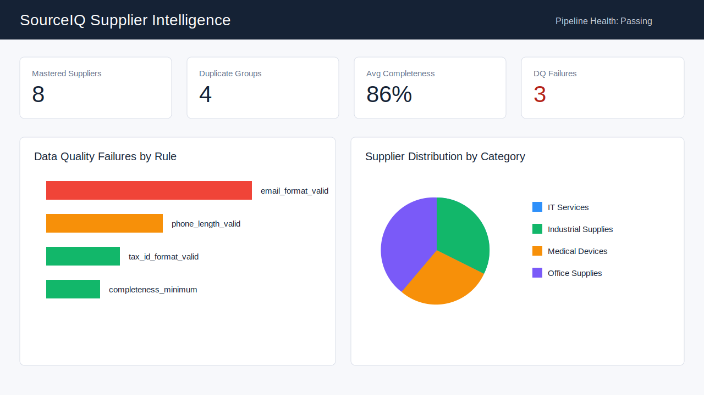
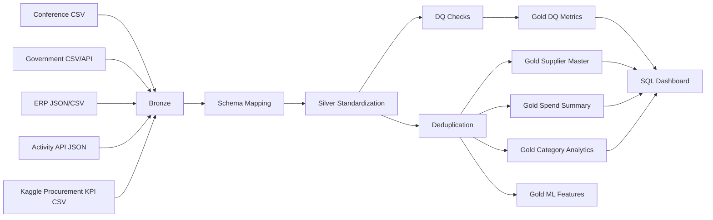

# SourceIQ Supplier Intelligence Lakehouse

Production-style supplier intelligence platform that ingests supplier data from multiple sources, standardizes it, validates data quality, deduplicates supplier identities, stores Bronze/Silver/Gold lakehouse outputs, and serves analytics plus ML-ready features.



## Verified Demo Run

This repository includes a completed end-to-end run using a realistic Kaggle procurement dataset plus mock supplier profile, ERP, government, conference, and activity API sources.

| Metric | Result |
| --- | ---: |
| Raw sources ingested | 5 |
| Kaggle procurement purchase orders | 777 |
| Silver standardized records | 794 |
| Gold mastered suppliers | 11 |
| Gold analytics and ML tables | 5 |
| Data quality rules executed | 7 |
| Unit tests | 6 passing |

Human-readable proof is available in [evidence/run_walkthrough.md](evidence/run_walkthrough.md).

## Problem Statement

Supplier data is scattered across event lists, government vendor datasets, ERP exports, and supplier activity APIs. Each source uses different schemas, inconsistent business names, incomplete contact information, and duplicate supplier records. This project builds a lakehouse pipeline that turns those messy inputs into a governed supplier master and analytics layer.

## Architecture



## Data Sources

| Source | Format | Role |
| --- | --- | --- |
| Conference supplier list | CSV | Messy event supplier data |
| Government vendor dataset | CSV/API-style extract | External supplier registry |
| ERP mock export | JSON | Coupa/SAP-style spend and vendor master data |
| Supplier activity API | JSON | Batch API supplier activity and risk signal |
| Kaggle Procurement KPI Analysis Dataset | CSV | Realistic purchase orders, supplier delivery, defect, compliance, and pricing metrics |

The Kaggle source is stored at [data/raw/kaggle/procurement_kpi.csv](data/raw/kaggle/procurement_kpi.csv) and can be refreshed with [scripts/download_kaggle_data.py](scripts/download_kaggle_data.py). Dataset page: [Procurement KPI Analysis Dataset](https://www.kaggle.com/datasets/shahriarkabir/procurement-kpi-analysis-dataset).

## Bronze/Silver/Gold Design

Bronze stores raw source-shaped records and adds `source_system`, `ingestion_timestamp`, `batch_id`, `raw_file_name`, and `source_priority`.

Silver maps every source into canonical columns using [configs/schema_mapping.yaml](configs/schema_mapping.yaml), then standardizes names, email, phone, address, category, NAICS, tax IDs, and completeness scoring.

Gold creates:

- `gold_supplier_master`
- `gold_supplier_quality_metrics`
- `gold_supplier_spend_summary`
- `gold_supplier_category_analytics`
- `gold_ml_supplier_features`

## Data Quality Rules

Rules live in [configs/dq_rules.yaml](configs/dq_rules.yaml). The framework outputs:

```text
dq_run_id
table_name
rule_name
records_checked
records_failed
failure_percentage
run_timestamp
severity
```

Implemented checks include supplier name completeness, email format, phone length, valid US state, tax ID format, duplicate score threshold, and minimum completeness.

## Deduplication Strategy

The deduplication engine uses:

- exact phone matching
- exact email matching
- normalized supplier name plus city/state blocking
- fuzzy supplier-name scoring with `rapidfuzz`
- survivorship by completeness score, source priority, and ingestion timestamp

Examples such as `ABC Technologies LLC`, `ABC Tech LLC`, and `ABC Technologies` resolve into one mastered supplier group when contact or name-location evidence matches.

## Orchestration

The Airflow DAG in [orchestration/supplier_pipeline_dag.py](orchestration/supplier_pipeline_dag.py) follows:

```text
ingest_raw_sources
-> validate_bronze
-> transform_to_silver
-> run_deduplication
-> run_quality_checks_and_build_gold
-> publish_metrics
```

A Databricks workflow definition is also included at [orchestration/databricks_workflow.yml](orchestration/databricks_workflow.yml).

## Dashboard

Dashboard-ready SQL lives in [sql/dashboard_queries.sql](sql/dashboard_queries.sql). The intended dashboard pages are:

- Supplier data quality overview
- Duplicate supplier analysis
- Supplier distribution by state/category
- Spend by supplier/category
- Pipeline run health

See [dashboard/dashboard_spec.md](dashboard/dashboard_spec.md) for the Power BI/Tableau/Databricks SQL build notes.

## Run Locally

Create an environment and install dependencies:

```bash
python -m venv .venv
source .venv/bin/activate
pip install -r requirements.txt
```

Run the full local pipeline:

```bash
export LAKEHOUSE_FORMAT=parquet
python -m src.pipeline
```

Refresh the Kaggle source data:

```bash
python scripts/download_kaggle_data.py
```

Export human-readable evidence CSVs and walkthrough:

```bash
python scripts/export_evidence.py
```

Run tests:

```bash
pytest -q
```

Run with Docker:

```bash
docker compose up --build
```

Or run the full Docker demo and evidence export:

```bash
docker compose run --rm sourceiq-pipeline
docker compose run --rm sourceiq-pipeline python scripts/export_evidence.py
```

To use Delta Lake locally or in Databricks:

```bash
export LAKEHOUSE_FORMAT=delta
python -m src.pipeline
```

## Business Impact

This project demonstrates the core  data platform work: multi-source supplier ingestion, schema normalization, trusted supplier mastering, quality observability, analytics marts, orchestration, SQL reporting, and ML-ready feature generation.

For a procurement intelligence team, the platform answers practical questions:

- Which suppliers have the highest spend?
- Which suppliers have duplicate identities across systems?
- Which supplier records are incomplete or invalid?
- Which suppliers have defect, compliance, delivery, or risk signals?
- Which mastered supplier features are ready for analytics or ML models?
 
## Verified Run Evidence

After the latest verified run, the evidence pack in [evidence/run_walkthrough.md](evidence/run_walkthrough.md) shows:

- 777 Kaggle procurement purchase orders ingested into Bronze
- 794 standardized Silver records across all sources
- 11 mastered Gold suppliers
- supplier spend summaries in the millions for Kaggle suppliers
- data quality results across 794 records
- ML-ready supplier risk/spend/completeness features
