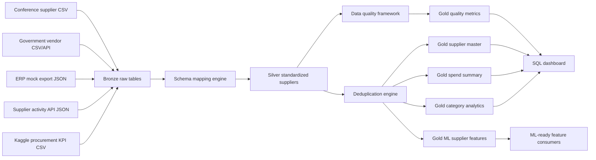

# SourceIQ Supplier Intelligence Lakehouse Architecture

## Problem

Supplier data usually arrives from inconsistent operational systems: event lists, public vendor databases, ERP exports, and supplier activity APIs. Each source uses different field names, data formats, quality levels, and duplicate supplier identities. SourceIQ turns those messy inputs into a mastered supplier intelligence layer for analytics and ML.

## Lakehouse Flow

## Storage Layers

### Bronze

Bronze stores source-shaped records with ingestion metadata:

- `source_system`
- `ingestion_timestamp`
- `batch_id`
- `raw_file_name`
- `source_priority`

### Silver

Silver maps all sources into canonical supplier fields, then standardizes:

- supplier name
- email and phone
- address, city, state, country
- category and NAICS
- tax ID
- completeness scoring

### Gold

Gold contains business-ready tables:

- `gold_supplier_master`
- `gold_supplier_quality_metrics`
- `gold_supplier_spend_summary`
- `gold_supplier_category_analytics`
- `gold_ml_supplier_features`

## Local vs Databricks

The project runs locally with Spark and Parquet by default. Set `LAKEHOUSE_FORMAT=delta` to use Delta Lake when `delta-spark` and compatible Spark jars are available, or run the same notebook scripts as Databricks workflow tasks.

## External Dataset

The CEO-demo run includes Kaggle's Procurement KPI Analysis Dataset as `kaggle_procurement_kpi`. It adds realistic purchase orders, supplier names, categories, order dates, delivery dates, quantities, negotiated prices, defective units, and compliance flags.
